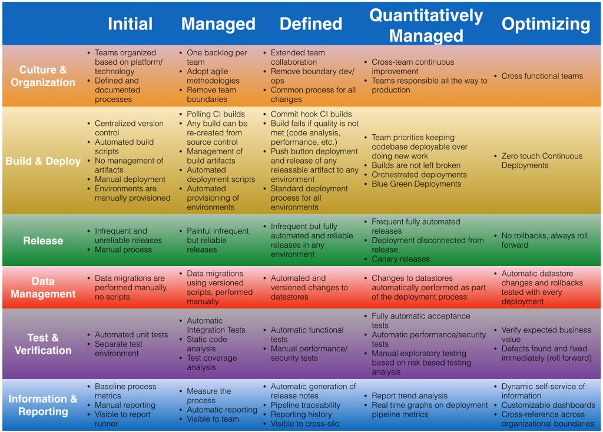
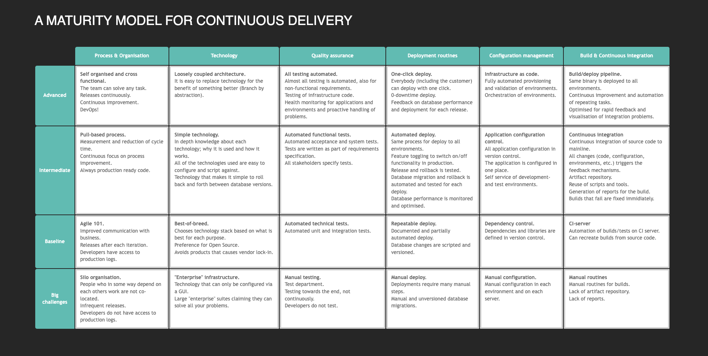

云原生吹水Ep.2 来聊聊：你觉得现在所在的 team CI/CD 建设的怎么样？欢迎大家用表情投票

1⃣️ 烂的一批，我要吐槽

2⃣️ 够用，还有很大的提升空间

3⃣️ 还行，没有多少地方能提升的了

4⃣️ 优秀，我要怒赞

为了评估我们的CI/CD (Continuous Integration/Continuous Delivery/Continuous Deployment)水平 今天给大家介绍一个概念：CI/CD成熟度模型（MATURITY MODEL）。这玩意可以用来指导我们进行CI/CD建设。

首先这个模型不是由某个权威机构发布的，有知名公司发布的，也有阿猫阿狗发布的。基本思想都差不多，只是维度上有些差别。

格式上来说都是两个轴：一个轴是成熟程度，另外一个轴是engineering活动分类。

我认为比较好看的是这两个：

* [bekkopen cd maturity-model](http://bekkopen.github.io/maturity-model/)一家挪威公司
* [Andreas Rehn，Tobias Palmborg，Patrik Boström版](https://mp.weixin.qq.com/s?__biz=MzUxNTEwNTg5Mg==&mid=2247488305&idx=1&sn=cf40ab3c34d3a997c8d9c7e7a890b4c6&chksm=f9bae63acecd6f2c5167c297e4a116c8f38bef7b62a8562fdb40434265e0be6eaccacab5dca7&token=594338237&lang=zh_CN#rd)。[原文](https://www.infoq.com/articles/Continuous-Delivery-Maturity-Model/)

 另外能search到的还有很多，可以参考

* [AWS marketplace](https://pages.awscloud.com/rs/112-TZM-766/images/A-Roadmap-to-Continuous-Delivery-Pipeline-Maturity-dev-whitepaper.pdf)
* [clarive](https://clarive.com/quick-check-your-continuous-delivery-maturity/)公司
* [NISI CD3M](https://nisi.nl/continuousdelivery/articles/maturity-model) 荷兰的一个基金会
* [Cloudbees](https://www.cloudbees.com/continuous-delivery/continuous-integration)

看这些图，我觉得对dev来说最难搞定的是测试，其他部分都可以交给基础设施来做，[各种自动化测试](https://k6.io/docs/test-types/introduction/)确是需要dev写的，你觉得呢？

devops讲究文化、流程、工具和平台，我们再来看看CI/CD pileline有哪些轮子可以用。

有实力的都上了CNCF的landscape： [App Definition and Development - Continuous Integration & Delivery](https://landscape.cncf.io/card-mode?category=continuous-integration-delivery&grouping=category)  

我个人倾向于将[这些轮子](https://www.one-tab.com/page/XVaE8S-wQzuVfMy430JQsA)按照盈利方式分类：

* 云厂商战略必备：[AWS CodePileline](https://aws.amazon.com/codepipeline/),[Azure Pipelines](https://azure.microsoft.com/en-us/services/devops/pipelines/),[Google Cloud Build](https://cloud.google.com/build),[阿里云云效](https://cn.aliyun.com/product/yunxiao/flow?from_alibabacloud=)，[腾讯云收购coding](https://cloud.tencent.com/product/coding)
* 闭源商业公司 SaaS: circleci,[teamcity](https://www.jetbrains.com/zh-cn/teamcity/ci-cd-guide/devops-ci-cd/),[cloudbees](https://www.cloudbees.com/products/continuous-delivery)...
* 开源+cloud/enterprise/self-host 模式: [drone](https://www.drone.io/),[travis-ci](https://www.travis-ci.com/product/)，[zadig](https://koderover.com/), [convox](https://convox.com/product/)...
* 完全开源: [Jenkins x](https://jenkins-x.io/),[agola](https://agola.io/),[dagger](https://dagger.io/),[Argo workflows](https://argoproj.github.io/argo-workflows/walk-through/steps/)(基于k8s CRD 定义流程的方式确实很云原生，和他类似的还有[testkube](https://testkube.kubeshop.io/)利用CRD定义测试)

有意思的是Jenkins X是[CloudBees发布的](https://www.infoq.cn/article/2018/04/jenkins-x-kubernetes)，开源对商业公司来说更多时候是市场竞争的一种手段。

对泥腿子来说你做的平台要想有人用前提就得开源，假设开源产品大火了对商业公司就产生了威胁，商业公司就会考虑开源一部分对冲一下风险，争夺一下话语权。

另外你还知道哪些和CI/CD有关的轮子不限于pileline类的，构建测试部署相关的都可以，欢迎分享。