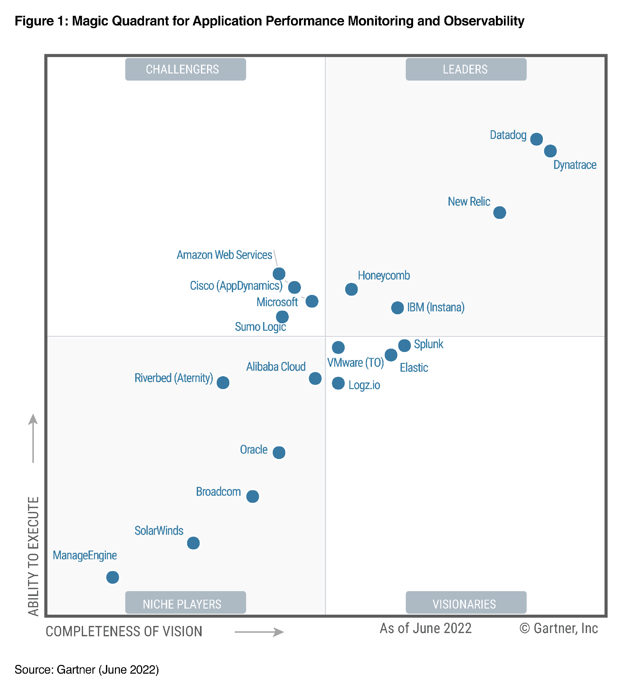

云原生吹水Ep.3 来看一下历史悠久、竞争异常激烈并且和dev密切相关的领域：可观测性（observability），但是这个话题太大，我们就只吹一点：云原生可观测标准化历史。先来看一下这些名词你认识几个？

* OpenTracing
* OpenCensus
* OpenTelemetry
* OpenMetrics 
* OpenObservability 

都不认识扣1，认识3个及以上扣2，很长一段时间我都分不清他们，如果你能如数家珍绝对是云原生老司机了。

这里的很多知识点来源于[这个电子书](http://icyfenix.cn/distribution/observability/tracing.html#%E8%BF%BD%E8%B8%AA%E8%A7%84%E8%8C%83%E5%8C%96)，我这里只是给大家做一下演绎性的总结，这个专栏写的很棒有兴趣可以追根溯源再去看一下专栏。

以下是我理解的时间线：

1. APM和基础监控时代，没有标准。典型的如[Zabbix](https://www.zabbix.com/)，现在的zabbix仍然宝刀未老在云原生可观测性领域仍占有一席之地。还有基于agent技术做APM性能监控的例如[oneapm](https://www.oneapm.com/)。这个时候在营销上还不怎么谈observability

2. **2010年**[Dapper论文](https://research.google/pubs/pub36356/)发布，dapper可以说是多数分布式系统链路追踪的祖师爷

3. 后来就是tracing领域百花齐放，然后大家想着要不搞个标准化吧，于是**2016年** OpenTracing  released,大家可以在从[这里](https://opentracing.io/specification/organization/)看到参与这个项目的有：Zipkin，LightStep，New Relic，DataDog，SkyWalking，Jaeger...

4. 但是Google反对OpenTracing,**2018年**开源了OpenCensus，想把metrics,tracing放在一个规范里

   > OpenTracing 规范公布后，几乎所有业界有名的追踪系统，譬如 Zipkin、Jaeger、SkyWalking 等都很快宣布支持 OpenTracing，但谁也没想到的是，Google 自己却在此时出来表示反对，并提出了与 OpenTracing 目标类似的 OpenCensus 规范，随后又得到了巨头 Microsoft 的支持和参与。OpenCensus 不仅涉及追踪，还把指标度量也纳入进来；内容上不仅涉及规范制定，还把数据采集的探针和收集器都一起以 SDK（目前支持五种语言）的形式提供出来。

​	这里就值得大家思考一下，为什么要把logs,metrics,tracing放在一起，假如我们用大腿想一下应该是他们总是息息相关，这里推荐一个[电子书专栏文章](https://lib.jimmysong.io/opentelemetry-obervability/history/)，解释了为什么要放在一起。

5. **2019年末** openTracing + openCenus=[OpenTelemetry](https://opentelemetry.io/docs/concepts/what-is-opentelemetry/) 两个项目合并了，新的项目是简称 `OTel`  	 

   OpenTelemetry不仅仅是文件规范它等于 tools+API+SDK 

​		现在如果你想学习可观测把精力focus在OpenTelemetry肯定没错了，现在可观测领域的厂商基本都在支持OTel,比如[Gartner魔力四象](https://www.elastic.co/explore/devops-observability/2022-gartner-magic-quadrant-apm)限上领跑的我们用的[datadog](https://docs.datadoghq.com/tracing/trace_collection/open_standards/#pagetitle)已经支持了.

​		但是OTel现在logs部分还是[draft状态](https://opentelemetry.io/status/)，[elastic ELK ](https://www.elastic.co/what-is/elk-stack)仍然是统治地位

稍微再一下谈另外两个：OpenMetrics，OpenObservability

OpenMetrics是prometheus将自己的实现做了标准化之后的产物，响应者寥寥，但是不影响在云原生领域metric老大哥的地位，可谓是事实上的标准，但是现在也要做[接入OTel的工作](https://opentelemetry.io/docs/reference/specification/metrics/sdk_exporters/prometheus/)，所谓一流的企业制定标准，人家可以通过标准直接实现降维打击，类似的例子有K8S是怎样一步步制定自己的标准将Docker完全移除的，这又是另一个故事了。

prometheus作为这个领域的竞争者之一确切的说应该是prometheus生态（prometheus + alter manager + thanos+grafana)

OpenObservability其实并不存在这个项目，只是OpenMetrics在[GitHub](https://github.com/OpenObservability?type=source)上的group name是这个，可见prometheus这帮人还是有的野心的。另外[OpenObservability](https://openobservability.io/)还是一个技术播客的名字，这纯属就是蹭流量了。

可以说标准化之争大局已定，带来的影响就是更激烈的市场竞争，更全面的可观测解决方案。log+metrics+tracing成了一揽子方案。

做搜索起家的elastic ELK（log)成功之后又进军基于metric的[Monitoring领域](https://www.elastic.co/observability)

做tracing起家的Skywalking现在也做了Logging，Metrics，而且还要基于现在大火的eBPF做profiling

这个领域最终鹿死谁手，谁将逐鹿中原，谁会一家独大尚未可知。

