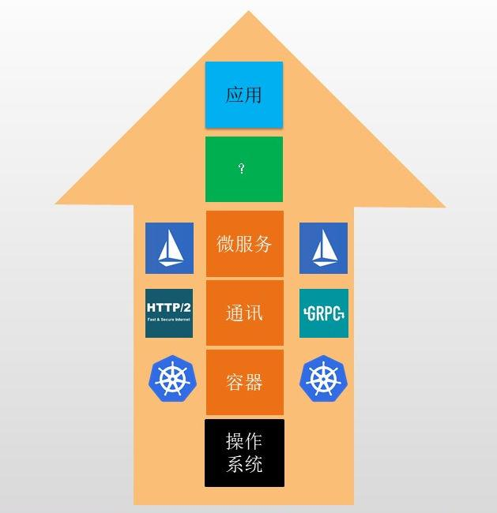

# Dapr的出现是云平台市场竞争的结果

AWS在公有云领域入日中天，Google又有云原生战略三驾马车：k8s,istio,gRPC, 当初Azure作为挑战者想要打开市场他能怎么做？

可以看下面这个图，2018年微软的人自然想到了往应用层发展：构想一个与平台无关的应用程序模型,使开发人员能独立于特定平台设计出分布式应用程序的拓扑。详细背景故事可以看这本[Dapr作者出的书](https://skyao.io/publication/202111-learning-dapr/#:~:text=%E3%80%82%E5%BD%93%E6%97%B6%EF%BC%8C%E6%88%91%E4%BB%AC%E6%AD%A3%E5%9C%A8%E6%9E%84%E6%83%B3%E4%B8%80%E4%B8%AA%E4%B8%8E%E5%B9%B3%E5%8F%B0%E6%97%A0%E5%85%B3%E7%9A%84%E5%BA%94%E7%94%A8%E7%A8%8B%E5%BA%8F%E6%A8%A1%E5%9E%8B%EF%BC%8C%E4%BD%BF%E5%BC%80%E5%8F%91%E4%BA%BA%E5%91%98%E8%83%BD%E7%8B%AC%E7%AB%8B%E4%BA%8E%E7%89%B9%E5%AE%9A%E5%B9%B3%E5%8F%B0%E8%AE%BE%E8%AE%A1%E5%87%BA%E5%88%86%E5%B8%83%E5%BC%8F%E5%BA%94%E7%94%A8%E7%A8%8B%E5%BA%8F%E7%9A%84%E6%8B%93%E6%89%91)。

同样作为挑战者的阿里云也是项目主要参与者




# Dapr 带来的改变一瞥

三大基础软件领域：操作系统，中间件，数据库。操作系统被容器抽象掉了，目前我们使用中间件的时候还得配合着client-sdk。

以存储一个key-value为例，开发仅仅是想保存个值而已，换一种存储或换一种开发语言，开发都得重新熟悉对应语言的的client sdk API.

例如：开始以redis存储，之后换成dynamodb存储，开发得重新熟悉dynamodb的client sdk.

又例如原来一部分是java开发另一部分用python开发,仍然保持使用redis存储，开发人员得同时熟悉两门语言的redis client-sdk使用。

现在有了Dapr就不必了，它在中间做了一层API抽象叫 [State stores](https://docs.dapr.io/reference/components-reference/supported-state-stores/),这样你就不必关系存储时候是redis,mysql还是其他了，应用程序存储的时候只需要向Dapr的sidebar pod发送一个HTTP或者gRPC请求，例如

```
curl -X POST -H "Content-Type: application/json" -d '[{ "key": "name", "value": "Bruce Wayne"}]' http://localhost:3500/v1.0/state/stateStoreName
# 向stateStoreName中存储一个kv， 3500是Dapr的sidebar HTTP协议监听端口，/v1.0/state/是固定的协议路径
```

类似state stores的这些能力Dapr中称为[Building blocks](https://docs.dapr.io/developing-applications/building-blocks/)，有点对应12-Factor中的[backing-services](https://docs.microsoft.com/en-us/dotnet/architecture/cloud-native/definition#backing-services)的感觉

总之Dapr(Distributed Application Runtime)降低了开发分布式系统应用程序的难度。

# 关注点分离导致分工是不变的趋势

起初大家都是程序员前面没有那么多title的，现在有了前端程序员，后端程序员，有搞操作系统的，有搞内核的，有搞编译器的，有搞虚拟机的。web领域的开发现在也有了进一步分离的趋势，云原生程序员与普通程序员。云原生程序员生产工具搞定背后的复杂性hold住所有非功能性需求。普通程序员不需要了解底层的复杂性只需要懂if else CRUD就OK了。

这种趋势对企业发展来说可能是好事情，假设以前需要雇佣2个高级程序员一共20块钱，现在只需要花5块钱雇佣一个初级程序员另外花10块钱到云厂商或自建的云平台。

但是马哲讲过，分工会提高效率但也是会导致人的异化。估计以后就再也没有人能full stack了