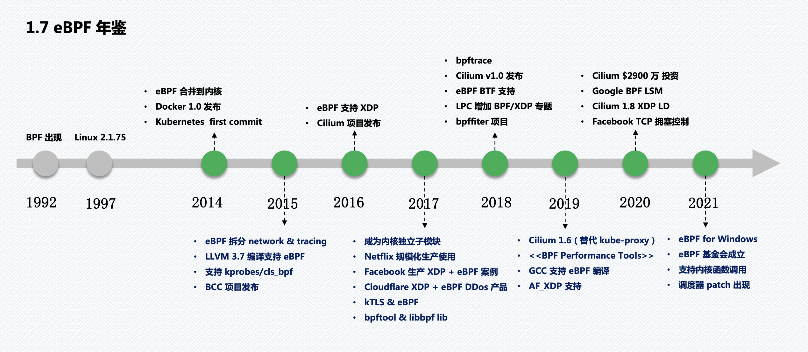

# 屁股决定脑袋？

两篇博文

[eBPF, sidecars, and the future of the service mesh](https://buoyant.io/blog/ebpf-sidecars-and-the-future-of-the-service-mesh) by buoyant公司 

​	service mesh产品 linkerd 背后的公司：文章总结起来就是说用eBPF做service mesh现在不行

[How eBPF will solve Service Mesh – Goodbye Sidecars](https://isovalent.com/blog/post/2021-12-08-ebpf-servicemesh/) by isovalent公司

​	开源产品Cilium背后的公司，文章自然是吹用eBPF的好处

另外Istio 也有一个项目叫[Merbridge](https://istio.io/latest/blog/2022/merbridge/) 使用eBPF替换sidebar基于iptables的service mesh.

so eBPF powered会不会是service mesh的未来？

# 啥是eBPF ？

> eBPF is a framework that allows users to load and run custom programs within the kernel of the operating system. That means it can extend or even modify the way the kernel behaves. In this report, you will learn about the ability to dynamically change the behavior of the kernel can be tremendously useful.

[有人将eBPF之于Linux比作javascript之于web](https://www.youtube.com/watch?v=f-oTe-dmfyI&t=507s)，[ebpf.io](https://ebpf.io/) 这是它的官网。

可以粗略的理解为：它是Kernel 3.18之后提供的一个feature，允许用户自定义eBPF程序经过LLVM编译成字节码，装载到内核态的VM执行，并且支持JIT运行时编译成机器码。最大的好处就是避免了copy，性能更高效。

图片来源：[_link](https://www.ebpf.top/post/ebpf_and_go/)

# buoyant公司：我好难！

我感觉这个创业公司的经历挺传奇的给大家梳理一下关键吃瓜事件

**2016 年 2 月**发布 Linkerd   0.1.0 版本，前Twitter 工程师[ William Morgan ](https://twitter.com/wm) 基于twitter的[finagle](https://twitter.github.io/finagle/) scala写的

**2016年9月** buoyant首次在SF Microservices上提出service mesh概念

**2016年10月** Lyft公司开源Envoy

Google、IBM和Lyft 联合**2017年**推出Istio 并在**2018年7月**发布了1.0版本。

​	Envoy忠实的帮Istio做好数据平面的事情

​	被称为service mesh2.0时代采用数据平面和控制平面架构

​	把Linkerd干的节节败退，创始人发推抱怨service mesh领域大家应该专注在产品研发而不是市场营销。

Buoyant破釜沉舟推出Conduit于**2017年12月**发布

​	采用数据平面+控制平面的架构，数据平面用Rust开发，控制平面用Go开发

**2018年7月** [conduit 改名 linkerd2.0](https://linkerd.io/2018/07/06/conduit-0-5-and-the-future/)

从这段历史来看Istio差点革了linkerd的命，现在又说要用eBPF代替sidebar，buoyant：又开始了，没完了

参考资料：blog [service mesh 年度总结](https://skyao.io/publication/)

# 保守派还是激进派？

新东西出现的时候总有人说，这也不行那也不行，但往往我们会犯一个错误：只能静态的看待问题，却忘了新事物会发展成长，而且其成长速度可能还是指数型

docker刚出来的时候还[有人嫌他费电](http://www.ifuun.com/a2017552068121/)。

m1刚出来的时候有人嫌他兼容性不好，我就听了这种人的鬼话买了intel，真JB后悔。

[现在的兼容性](https://doesitarm.com/)

所以你是保守派还是激进派？
