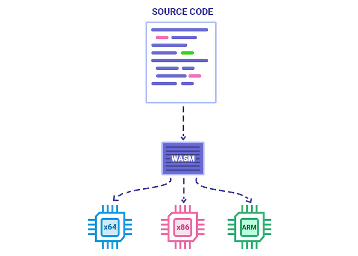
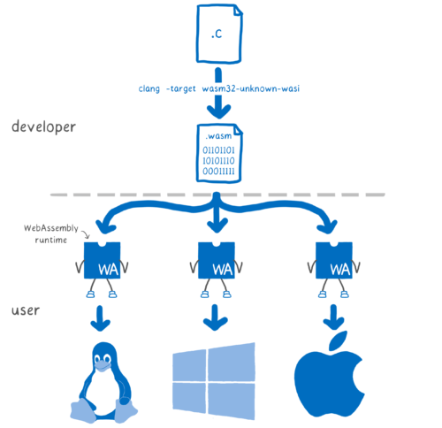

webAssembly除了应用在前端和区块链领域，在云原生领域也有一些应用场景。

# webAssembly with k8s

**webAssembly runtime作为一种pod类型。**

基本原理是实现一个特殊的kubectl,然后将webAssembly的deployment selector到这个运行特殊kubectl的节点，这个节点有webAssembly runtime 能够运行webAssembly程序。

目前有 azure 在做这件事情，这是 Azure官方AKS如何开启并使用这个特性的指南： https://learn.microsoft.com/en-us/azure/aks/use-wasi-node-pools。

为什么做？

在 azure 开源版本 krustlet blog中提到：

> Our hunch is that WebAssembly is going to play a tremendous role as a cloud technology–well beyond the browser

可见是信仰的力量。。。

有什么好处？

* 比docker更小的包，更快的冷启动速度
* 相较于基于Linux内核的[OCI](https://opencontainers.org/)运行在 arm 架构上还是挺麻烦的，但是WebAssembly就没这个问题

# webAssembly with gateway 

现代云原生网关都追求很强的扩展能力。

以下云原生网关都使用了webAssembly作为扩展能力的实现方式。

1. https://apisix.apache.org/zh/blog/2021/11/19/apisix-supports-wasm/

2. https://megaease.com/zh/blog/2021/09/17/extend-backend-application-with-webassembly/

 	网红程序员左耳朵耗子的公司easegress产品。

基本原理是将webAssembly嵌入到Gateway，用户使用其他语言编写规则逻辑脚本，编译成webAssembly,网关进行加载脚本执行，根据结果决定网关下一步动作。

以apiv3举个例子，假设apiv3也集成了webAssembly runtime，每个service请求都会加载service自定义的webAssembly代码执行。可以在webAssembly代码里实现比如鉴权的逻辑，如果鉴权失败return 401,网关就不需要把流量转发到service了。

还有一个easegress的[用来做秒杀的应用案例](https://megaease.com/zh/blog/2021/09/08/how-to-do-an-online-flash-sale-event-with-easegress-and-webassembly/)，基本思路是一致的就是在调用目标service之前先调用webAssembly代码，主要要两个好处，1.执行环境是隔离的

2. 可以用多种语言编写script然后编译成webAssembly字节码。

# with Rule Engine

还没看到有人这样用，只是我的一个想法，比如做资源风险巡检这个场景，不同的资源有不同的check规则，我们可以将运营中会变化的逻辑通过webAssembly的脚本实现，然后在应用中嵌入webAssembly runtime运行这段代码，将规则和应用程序分离。

# concepts

### webAssembly runtimes & WASI

webassembly-runtimes 是webassembly代码的运行时,有很多实现：https://blog.logrocket.com/webassembly-runtimes-compared/

因为webassembly-runtimes是隔离的并不能直接syscall访问操作系统，WASI是和操作系统之间的API。

如果想玩一下的话，推荐：[wasmtime](https://pkg.go.dev/github.com/bytecodealliance/wasmtime-go#section-readme)。

